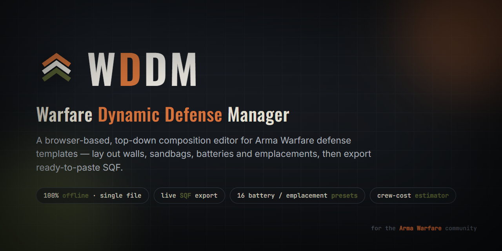
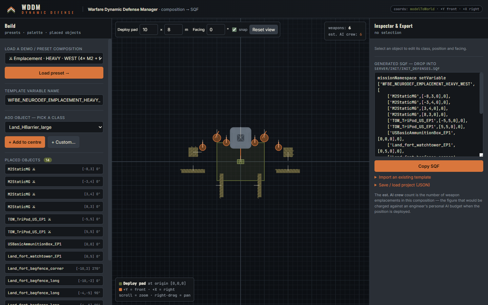
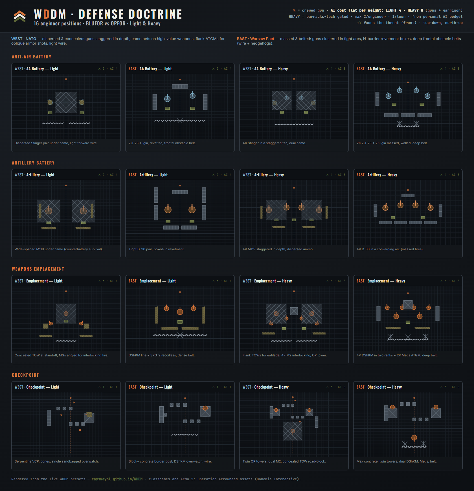

<div align="center">



# WDDM — Warfare Dynamic Defense Manager

**A browser-based, top-down composition editor for Arma "Warfare" defense templates.**
Lay out walls, sandbags, batteries, emplacements and checkpoints on a grid, then export
ready-to-paste **SQF** for your mission. One file, fully offline, no install.

[**▶ Open the editor**](https://rayswaynl.github.io/WDDM/) · [Quick start](#quick-start) · [Templates](#built-in-presets) · [How it works](#how-it-works) · [Using exports in a mission](#using-the-export-in-a-mission)

</div>

---

## What it does

Arma Warfare missions place "compositions" — a parent object (a factory, or a deploy point)
plus a list of child objects at **relative offsets**. WDDM is a visual editor for exactly
that data structure. Instead of guessing `[x, y, z]` offsets and directions by hand, you
drag objects around a top-down canvas and the tool writes the SQF for you.



### Built-in doctrine layouts

All 16 engineer presets at a glance — BLUFOR vs OPFOR, Light & Heavy, laid out to
Cold War defensive doctrine (NATO dispersed & concealed · Warsaw Pact massed & belted):



- **Drag-and-drop layout** — move objects, drag the handle to rotate, arrow-keys to nudge (Shift = 1 m), 0.5 m grid snap.
- **Textured top-down icons** — H-barriers, sandbags, fortified nests, camo nets, razor wire, concrete blocks, cones, and distinct silhouettes for MG / AT / AA / artillery weapons.
- **Live SQF export** — a `missionNamespace setVariable [...]` block updates as you build; one-click copy.
- **Crew-cost estimator** — counts crewable weapon emplacements (1 gunner each) so you can see a layout's AI cost while you design it.
- **Rotation preview** — a "facing" control rotates the whole composition so you can confirm it stays coherent when the building is placed at any heading (matches Arma's `modelToWorld` math).
- **Import** an existing template to edit it, and **save/load** your work as JSON.
- **18 built-in presets**, including the four faction-specific defense types in light & heavy variants.

> WDDM is engine-agnostic about *what* you build — any classname string works, so it's
> equally useful for Arma 2 (OA), Arma 3, and forks of the various Warfare modes.

---

## Quick start

**Option A — just use it**
Open the hosted version: **https://rayswaynl.github.io/WDDM/**

**Option B — run locally**
```bash
git clone https://github.com/rayswaynl/WDDM.git
cd WDDM
# open index.html in any modern browser — that's it, no build step
```
`index.html` is completely self-contained (the only external request is Google Fonts,
and it degrades gracefully to system fonts offline).

---

## Using the editor

| Action | How |
|---|---|
| Load a starting layout | Pick from **Load a demo / preset** → *Load preset* |
| Add an object | Pick a class from the palette → **+ Add to centre**, or **+ Custom…** to type any classname |
| Move | Drag the object body |
| Rotate | Drag the white handle, or edit *Relative direction* in the inspector |
| Nudge | Arrow keys (hold **Shift** for 1 m steps) |
| Pan / zoom | Right-drag to pan · scroll to zoom |
| Check rotation | Change **Facing** in the top toolbar to preview the placed heading |
| Export | Copy the **Generated SQF** on the right |
| Import | Expand *Import an existing template*, paste the entries, **Load** |
| Save / load project | Expand *Save / load project (JSON)* |

### Coordinate model

- The **deploy pad** sits at the origin `[0, 0, 0]`. `+Y` is **front**, `+X` is **right**.
- Each child is stored as `['Classname', [x, y, z], relativeDir]`.
- At spawn time the engine rotates the offset into world space with `origin modelToWorld [x,y,z]`
  and faces each object with `setDir (originDir − relativeDir)`, so the whole compound
  rotates as one rigid body.
- **Z is intentionally ignored** for ground compositions (the common `CreateDefenseTemplate`
  helper flattens every object with `_toWorld set [2,0]`). The editor shows a Z field for
  completeness but marks it ⚠.

---

## Built-in presets

Besides the real WASP **Barracks factory walls** (included as a worked reference) and a
blank canvas, WDDM ships the four engineer defense types, each in **Light** and **Heavy**
weight and **BLUFOR (WEST) / OPFOR (EAST)** variants:

| Type | Light — guns | Heavy — guns |
|---|---|---|
| **AA Battery** | WEST 2× Stinger · EAST ZU-23 + Igla | WEST 4× Stinger · EAST 2× ZU-23 + 2× Igla |
| **Artillery Battery** | 2× howitzer (M119 / D-30) | 4× howitzer |
| **Weapons Emplacement** | 2× MG + 1× AT | 4× MG + 2× AT + watchtower |
| **Checkpoint** | chicane + overwatch MG + guard tower | twin towers, 2× MG + 1× AT, hardened chicane |

**AI cost is cheap — one soldier per crewable weapon, no garrison.** A position costs only
its gun count: light **AA/Arty = 2**, light **Emplacement = 3**, light **Checkpoint = 1**;
heavy **4 / 4 / 6 / 3**. That crew comes out of the engineer's personal AI budget. HEAVY is
gated behind the side's Barracks upgrade; limits are 2 positions per engineer and 1 per town,
within 250 m of a friendly town centre — so you can dot cheap fortifications across the map.

> Note: stock Arma 2 OA has no static *bullet*-AA for the US side, so the WEST AA battery
> uses Stinger (rocket) pods; OPFOR gets a true rocket + bullet mix (ZU-23 + Igla).

---

## How it works

WDDM is a single HTML file with three panels:

1. **Build** (left) — presets, the class palette, and the list of placed objects.
2. **Canvas** (centre) — an HTML5 `<canvas>` that draws each object in its own rotated local
   frame, so textures and footprints rotate correctly.
3. **Inspector & Export** (right) — per-object class/position/direction fields and the live SQF.

The output format is a single `missionNamespace setVariable` call holding an array of
`['classname', [x,y,z], dir]` tuples — the shape consumed by composition spawners like
`CreateDefenseTemplate` in WASP-derived Warfare missions.

---

## Using the export in a mission

WDDM produces a named template variable, e.g.:

```sqf
missionNamespace setVariable ['WFBE_NEURODEF_EMPLACEMENT_HEAVY_WEST',[
    ['M2StaticMG',[-8,3,0],0],
    ['M2StaticMG',[8,3,0],0],
    ['TOW_TriPod_US_EP1',[-5,5,0],0],
    // ...
]];
```

To spawn it, you need a composition helper that takes an **origin object** + the template
array, places each child relative to the origin, and flattens to ground. The canonical
WASP helper looks like this:

```sqf
// CreateDefenseTemplate.sqf — [originObject, template] call ...
private ["_origin","_template","_dir","_created"];
_origin   = _this select 0;
_template = _this select 1;
_dir = getDir _origin;
_created = [];
{
    private ["_obj","_relPos","_relDir","_o","_world"];
    _obj = _x select 0; _relPos = _x select 1; _relDir = _x select 2;
    _o = createVehicle [_obj, [0,0,0], [], 0, "NONE"];
    _world = _origin modelToWorld _relPos;
    _world set [2, 0];
    _o setDir (_dir - _relDir);
    _o setPos _world;
    _created = _created + [_o];
} forEach _template;
_created
```

Then, anywhere you have a position + direction:

```sqf
_helper = "Land_HelipadEmpty" createVehicle _pos;   // invisible origin
_helper setDir _dir;
_built  = [_helper, missionNamespace getVariable 'WFBE_NEURODEF_EMPLACEMENT_HEAVY_WEST'] call CreateDefenseTemplate;
deleteVehicle _helper;
```

Static weapons spawn **empty**; crew them with `createUnit` → `moveInGunner` if you want
manned positions.

---

## Regenerating the banner

The social banner is rendered from `docs/banner-source.html`:

```bash
# serve the folder and screenshot docs/banner-source.html at 1280×640
python -m http.server 8000
# open http://localhost:8000/docs/banner-source.html and capture at 1280x640
```

---

## Credits & license

- Built for the **Arma Warfare** community.
- Visual identity (palette, logo, fonts) from **Miksuu's Warfare** — used here with permission.
- Developed with the help of [Claude](https://www.anthropic.com/claude), Anthropic's AI assistant.
- Licensed under the [MIT License](LICENSE) — free to use, fork, and adapt.

Classnames in the presets reference Bohemia Interactive's Arma 2: Operation Arrowhead
assets and are the property of their respective owners; WDDM ships no game content.
